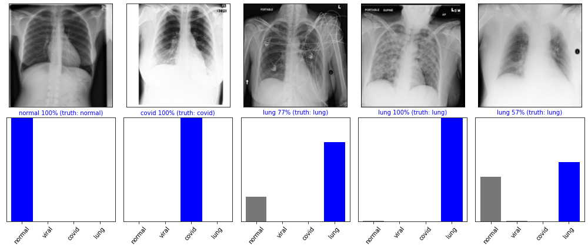
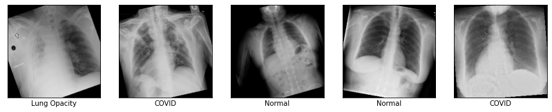
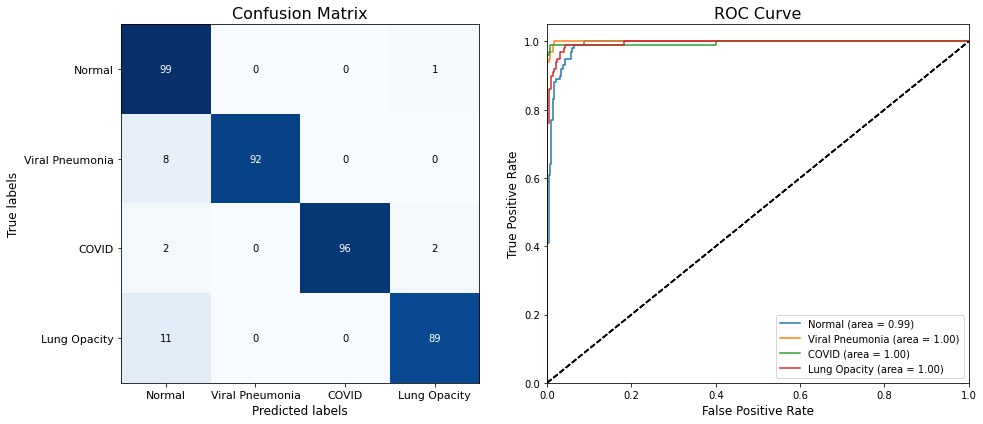
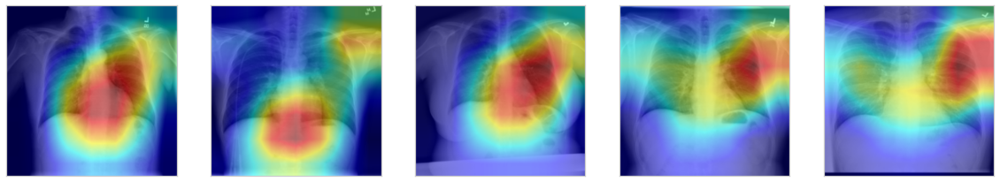

# Detecting COVID-19 with Chest X-Ray

In this repo, I tried to apply deep learning to medical image processing and build a model that identifies COVID-19 infection in radiology images. Residual Network was fined-tuned on real chest X-Ray images of COVID-19 and healthy patients. The model classifies chest X-Ray images into one of four classes: Normal, Viral, Pneumonio and COVID-19. The trained model was evaluated on 400 actual test subjects and achieved 95% overall accuracy.


## Installation
```bash
# clone this repo
$ pip install -r requirements.txt
```

## Dataset

[COVID-19](https://www.kaggle.com/tawsifurrahman/covid19-radiography-database) radiography dataset from Kaggle was used for the expirement. This dataset contains 3616 COVID-19 positive cases along with 10,192 Normal, 6012 Lung Opacity (Non-COVID lung infection) and 1345 Viral Pneumonia images. The dataset was randomly split into valid(400), test(400) and training(remaining) sets without overlap.

| Class | Meaning |
| :---: | :---: | 
| `COVID-19` |  Confirmed positive cases of COVID-19 patients |
| `Normal` | Healthy people who have no lung infection or disease |
| `Viral Pneumonia` | [Pneumonia](https://patient.uwhealth.org/healthfacts/5604) is a serious infection in the lungs. It can result from viruses, bacteria, or fungi. Most often, it occurs as a result of a viral illness, such as influenza (flu), measles, or respiratory syncytial virus. |
| `Lung Opacity` | Lung opacity means pneumonia caused by any previously known pathogen. |

## Results
#### Data augmentation
The following images are generated from the training data using image augmentation. Image augmentation is a technique of altering the existing data to create some more data for the model training process and prevent the overfitting problem. 


#### Evaluation
On 400 random test images (100 positive for COVID-19), the overall accuracy of the trained model was 95% with AUC 0.98 score.


#### Visualization
Visual explanations through gradient-based localization using [grad-CAM](https://github.com/jacobgil/pytorch-grad-cam). The areas marked with a peak in heatmap indicate the prediction of infection with high probabilities.


## Reference
Coursera, [DeepCOVID](https://github.com/shervinmin/DeepCovid), Deep-COVID: Predicting COVID-19 From Chest X-Ray Images Using Deep Transfer
Learning, [Automated abnormality classification of chest radiographs](https://www.nature.com/articles/s41746-020-0273-z.pdf).
