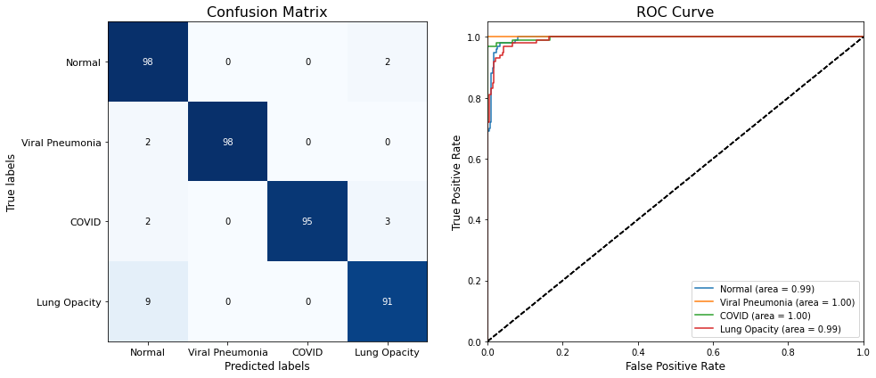
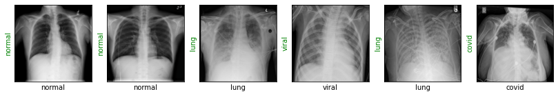

# Detecting COVID-19 with Chest X-Ray

In this repo, I tried to make a classifier that identifies COVID-19 infection in radiology images. In the experiment, ResNet18 was used and trained on the real chest X-Ray images of COVID-19 and healthy patients. The model classifies Chest X-Ray images in one of four classes: Normal, Viral, Pneumonio and COVID-19. The trained model was evaluated on 400 actual test subjects and achieved a sensitivity rate of 98% with 95% overall accuracy.


## Installation
```bash
$ git clone https://github.com/spacewalk01/detecting-covid19-with-chest-XRay
$ cd detecting-covid19-with-chest-XRay
$ pip install -r requirements.txt
```

## Dataset

COVID-19 Radiography Dataset can be downloaded from [Kaggle](https://www.kaggle.com/tawsifurrahman/covid19-radiography-database). Chest X-ray images for COVID-19 positive cases along with Normal and Viral Pneumonia images. This COVID-19 dataset contains 3616 COVID-19 positive cases along with 10,192 Normal, 6012 Lung Opacity (Non-COVID lung infection) and 1345 Viral Pneumonia images. 

| Class | Meaning |
| :---: | :---: | 
| COVID-19 |  Confirmed positive cases of COVID-19 patients |
| Normal | Healthy people who have no lung infection or disease |
| Viral Pneumonia | Pneumonia is a serious infection in the lungs. It can result from viruses, bacteria, or fungi. Most often, it occurs as a result of a viral illness, such as influenza (flu), measles, or respiratory syncytial virus. |
| Lung Opacity | Lung opacity means pneumonia caused by any previously known pathogen. |
## Results

Evaluation metrics:


Predicted results:



